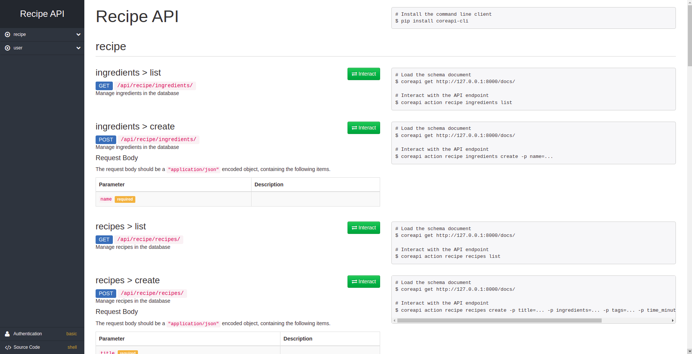

# Recipes API

API REST para criar e armazenar receitas, ingredientes e usuários.

## Objetivo

Esta API desenvolvida com o django-rest framework tem como objetivo fornecer uma aplicação para criação de receitas. Entre seus principais recursos, estão:

* Cadastro de usuário
* Cricação de receitas com:
    * Tempo de preparo;
    * Ingredientes;
    * Tags para classificar o tipo de receita;
* Integração com Travis-CI e execução através de containers;
* Testes automatizados;

## Como utilizar
---
Para utilização da API, clone o repositório e tenha do Docker previamente instalado. Feito isso, basta executar o seguinte comando para construção dos containers:

```shell
$ docker-compose up --build
```

Após isso, basta acessar o seguinte endereço para verificar a documentação da API:

```shell
http://127.0.0.1:8000/docs/
```

<p align="center">
    
</p>

Para executar os testes, tantos unitários, quanto de sintaxe, execute o seguinte comando:

```shell
docker-compose run --rm app sh -c "python manage.py test && flake8"
```

## Licença

MIT © Rafael Hiller

## Autor

Feito por Rafael Hiller.

[](https://www.linkedin.com/in/rafael-hiller-0aa187133/) 